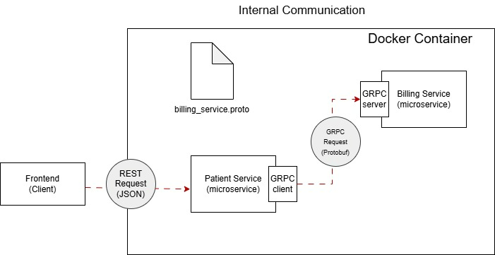

# 🏥 Patient Management System with Microservices

A full-fledged **Patient Management System** built using **Java Spring Boot** and deployed with **AWS**, designed with a scalable microservices architecture.

---

## 📸 Internal Communication

---

## 🚀 Technologies Used

- **Java 21**
- **Spring Boot**
- **Spring Cloud**
- **Spring Security + JWT**
- **Spring Data JPA**
- **MySQL / PostgreSQL**
- **Docker & Docker Compose**
- **AWS EC2 / S3 / RDS**
- ** Kafka/ gRPC**
- **Swagger docs**

---

## 🧩 Microservices Architecture

This system is composed of several services:

- **API Gateway**
- **Patient Service**
- **Auth Service**
- **Config Server**

---

